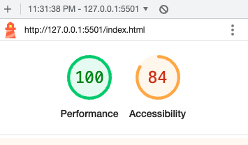

# cookie-stand

## Code-Fellows Lab 9
This is a website for the salmon cookies lab at Code Fellows. This website contains several feature include a table and form within the sales data tab.

## Motivation

Learn more about JavaScript/CSS/ and HTML

## Build Status

Pending...

## Tech/Framework Used

HTML, CSS, JavaScript

## Features

Accessibility score 100

## How to use?
You can navigate the website by click on the different Nav elements at the top of the page

## Credits

## License
MIT © Drew Stroede

## Paired Programming
